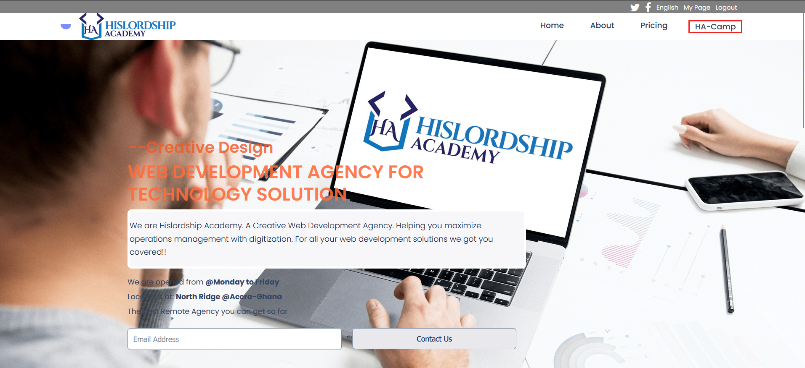
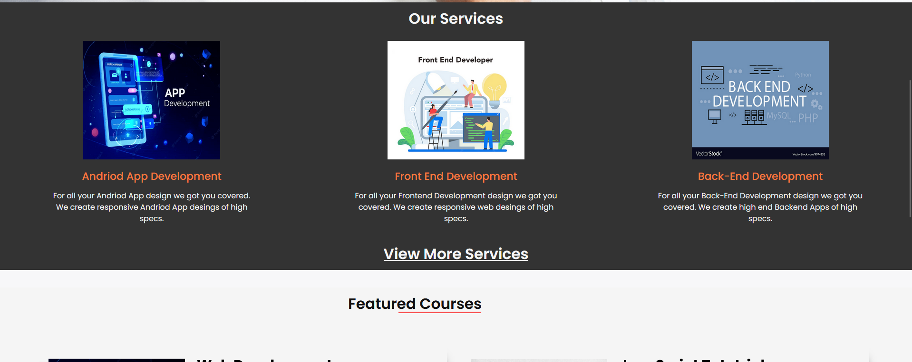
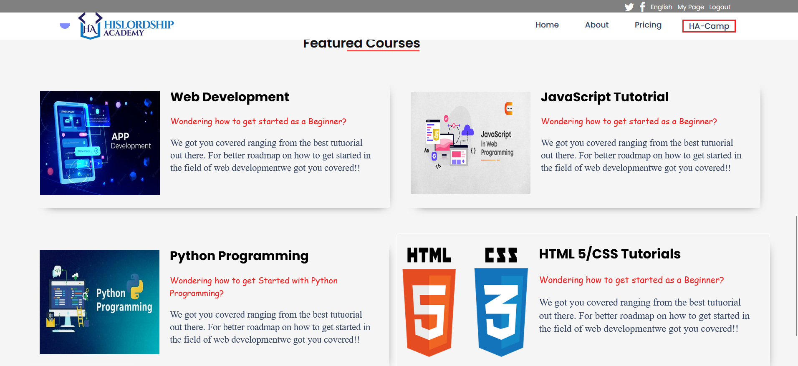

# Capstone-Project

# Project Overview
This Capstone projects is about showcasing the idea of a web development agency where people can come to for website to be created for them and also those who want to learn web development can enroll in the bootcamp

Built With the following stack
HTML CSS Js Linters
Javascript
Getting Started

To get a local copy up and running follow these simple example steps. 1-Click on Code button. 2-Click on the link to copy it.
1. Prerequisite

In order to use npm, node packages must be installed
2. Installation
go to your terminal and git clone the repo link you copied
 install npm modules

npm i

 ###To install necessary dependencies,

initialize npm to create package.json file.

npm init -y or (npm install --save-dev hint@6.x)

### 3. Demo Result

npm start

[Live Demo Link](https://hislordshipprof.github.io/Capstone-Project/)

### 4. Builds for publish

npm run build

### Folder Structure of Source Code

`./Capstone-Project/img` all images files
`./Capstone-Project/README` file
`./Capstone-Project/index.html` file
`./Capstone-Project/styles.css` CSS file
`./Capstone-Project/package.json files

## Authors

👤 **Benjamin Agyekum**

- GitHub:[@githubhandle](https://github.com/hislordshipprof)
- LinkedIn:[benjamin-agyekum](https://www.linkedin.com/in/benjamin-agyekum-5962b7126)

🤝 Contributing

Contributions, issues, and feature requests are welcome!

Feel free to check the [issues page](../../issues/).

Show your support

Give a ⭐️ if you like this project!

## Acknowledgments
Original design idea by [Cindy Shin in Behance](https://www.behance.net/)

## 📝 License

This project is [MIT](./MIT.md) licensed.
